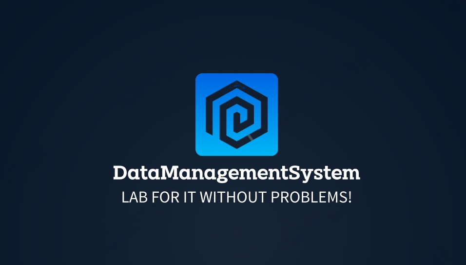
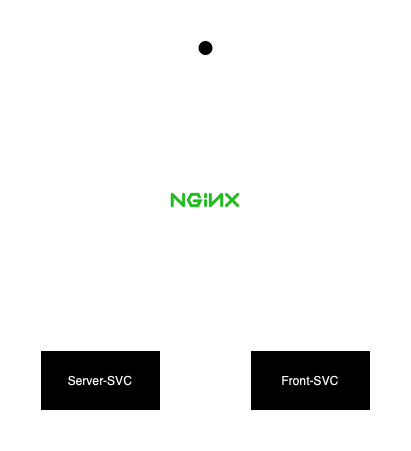

# Management System for everyone

## Architecture
System adheres microservice architecture:


Stack used to build the system:
- Backend: Python + FastAPI
- Frontend: React + Bootstrap + ChatGPT

## Deployment
To deploy working data management system just use:
```
docker-compose up --build
```

## Documentation
All the documentation regarding endpoints are located at the `/docs` endpoint.
